<div align="center">

<!-- Terminal Hero Graphic -->
<a href="https://github.com/eayushsingh">
  <picture>
    <source media="(prefers-color-scheme: dark)" srcset="./assets/terminal.svg">
    <source media="(prefers-color-scheme: light)" srcset="./assets/terminal.svg">
    
  </picture>
</a>

<br/><br/>

[](https://github.com/eayushsingh)
[](https://github.com/eayushsingh?tab=followers)
[](https://github.com/eayushsingh?tab=repositories)
[](LICENSE)

<br/>

```text
┌────────────────────────────────────────────────────────────────────────┐
│  ⚡ AI Engineer · Full-Stack Developer · FinTech Systems Builder        │
│  Designing high-throughput backends & intelligent autonomous workflows │
└────────────────────────────────────────────────────────────────────────┘
```

</div>

---

### 🖥️ `$ cat ~/focus.json`

```json
{
  "engineer": "Ayush Singh",
  "alias": "eayushsingh",
  "role": "AI Engineer & Full-Stack Developer",
  "core_competencies": ["Distributed Systems", "Backend Architecture", "LLM Pipelines", "FinTech Infrastructure"],
  "tech_foundations": ["Python", "Java", "TypeScript", "FastAPI", "Spring Boot", "Next.js"],
  "focus": "High-concurrency systems, transactional reliability & AI orchestration"
}
```

---

### 🛠️ `$ ./list-tech-stack.sh`

<div align="center">

#### **Languages & Core**
<p>
  
  
  
  
  
  
  
</p>

#### **Frameworks & Architecture**
<p>
  
  
  
  
  
  
</p>

#### **AI, ML & Distributed Infrastructure**
<p>
  
  
  
  
  
  
  
  
</p>

</div>

---

### 📊 `$ git status --live-metrics`

<div align="center">


<br/>


</div>

---

### 🧩 `$ leetcode --stats eayushsingh`

<div align="center">
  
</div>

---

### 🚀 `$ ls -la ~/projects`

| System / Project | Description | Architecture & Stack |
| :--- | :--- | :--- |
| 🤖 **[callingAgent](https://github.com/eayushsingh/callingAgent)** | Autonomous conversational voice & dispatch agent with streaming LLM inference | `Python` `FastAPI` `AI Agents` `LLMs` |
| 🌐 **[Solith.in](https://github.com/eayushsingh/Solith.in)** | High-performance digital product infrastructure & scalable web platform | `TypeScript` `Next.js` `TailwindCSS` |
| ⚡ **[Spring Boot Microservices](https://github.com/eayushsingh/spring-boot-practice)** | High-concurrency backend patterns, REST services, and database persistence | `Java` `Spring Boot` `PostgreSQL` |
| 💼 **[Production Client Platforms](https://github.com/eayushsingh)** | Full-stack production applications, tax ledger services & media processing | `React` `Node.js` `TypeScript` `SQL` |

---

### 📬 `$ ./connect.sh`

<div align="center">

[](https://github.com/eayushsingh)
[](https://www.linkedin.com/in/)
[](https://twitter.com/eAyyushhSingh)
[](https://leetcode.com/eayushsingh)

<br/>

```bash
# Clone this repository
git clone https://github.com/eayushsingh/eayushsingh.git
```

</div>

<div align="center">
  <sub>Engineered with ⚡ by <b>Ayush Singh</b></sub>
</div>
