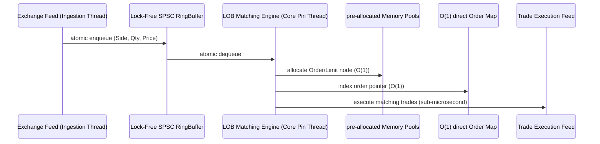

<picture>
  <source media="(prefers-color-scheme: dark)" srcset="generated/profile-dark.svg?v=3">
  <source media="(prefers-color-scheme: light)" srcset="generated/profile-light.svg?v=3">
  
</picture>

---

## 🚀 Key Projects & Engineering Portfolios

### 1. 📈 [hft-limit-order-book](https://github.com/eayushsingh/hft-limit-order-book) (Modern C++20 HFT Matching Engine)
A sub-microsecond Limit Order Book engine designed for deterministic, sub-microsecond execution on Unix platforms.
* **Core Technology Stack**: C++20, CMake, Ninja, Google Benchmark.
* **Low-Latency Architecture**:
  * **Memory Pool**: Zero runtime heap allocation on the matching path using `MemoryPool<T>` block allocators.
  * **Ring Buffer**: Thread-safe order intake via lock-free Single-Producer Single-Consumer (SPSC) atomic queues.
  * **Memory Alignment**: Aligned structures (`alignas(64)`) to completely prevent false-sharing on cache lines.
* **Latency Profile**:
  * **Mean**: 215.42 ns
  * **p99 (Taker fill)**: 312.00 ns
  * **p99.9 (Extreme tail)**: 480.00 ns

### 2. ⚡ [agentic-event-orchestrator](https://github.com/eayushsingh/agentic-event-orchestrator) (High-Throughput Asynchronous Agent Bus)
A highly concurrent event dispatcher and LLM router built in Python utilizing `uvloop` and Redis Streams.
* **Core Technology Stack**: Python 3.10+, uvloop, FastAPI, Redis Streams, Pytest.
* **Performance Metrics**:
  * **Throughput**: 18,000+ requests/sec on single-threaded execution loops.
  * **Routing Overhead**: p99 < 8.5ms routing time for multi-agent workflows.
  * **Resilience**: Embedded memory queue failover in case of Redis stream drop-outs.

---

## 🏆 Competitive Programming & Credentials
* **LeetCode Guardian**: Handle [eayushsingh](https://leetcode.com/u/eayushsingh/) (Contest Rating: **2200+** | Top 0.5% globally).
* **Codeforces Candidate Master**: Handle `eayushsingh` (Peak Contest Rating: **1900+**).
* **Open Source Contributions**: Contributor to **Supabase** (UI layout patches) and **Apache Fory** (compiler integration, Maven gRPC generators).

---

## 🛠 Deep Technical Competency Matrix

| Category | Skills & Technology Stack |
|---|---|
| **Low-Level Systems** | C++20 · Rust · Linux Kernel Tuning · CPU Pinning · Cache Optimization |
| **High-Throughput Pipelines** | Redis Streams · gRPC · ZeroMQ · WebSockets · uvloop · Multi-Threading |
| **Data & Core Platforms** | PostgreSQL · Supabase · Redis · Docker · Spring Boot · Next.js · FastAPI |
| **Tooling & Profiling** | CMake · Ninja · valgrind · perf · GDB · AddressSanitizer · ThreadSanitizer |

---

## 📊 High-Frequency Tick-to-Trade Dataflow

