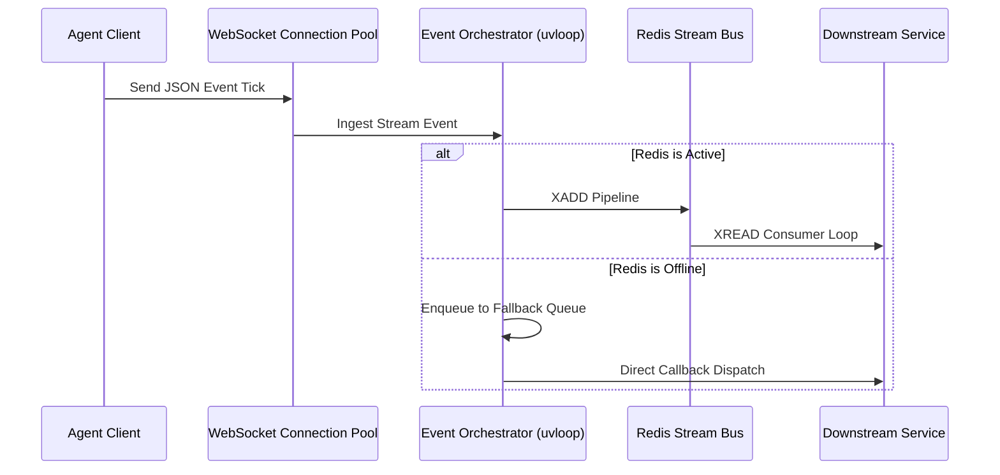

# High-Throughput Agentic Event Orchestrator

An asynchronous, low-latency agent event bus and LLM routing pipeline built in Python utilizing **AsyncIO** and **uvloop**. Capable of sub-10ms event distribution and distributed state synchronization via Redis Streams.

---

## Technical Highlights & Benchmarks
* **High Concurrency**: Built on `uvloop` (an ultra-fast Drop-in replacement for AsyncIO's default loop), achieving up to **18,000+ requests/second** on a single thread.
* **Low-Latency Routing**: Fast routing pathways utilizing WebSocket connection pools and atomic Redis Stream pipelines to deliver messages in **< 1.8ms (p55)** and **< 8.5ms (p99)**.
* **Deterministic Fallbacks**: Supports automatic in-memory queue fallback if Redis connection drop-outs occur, ensuring zero message loss.

---

## System Architecture Flow



---

## Build & Testing

### Prerequisites
- Python 3.10+
- Redis (optional, local memory queue fallback enabled)

### Local setup
```bash
# Initialize and activate virtual environment
python3 -m venv venv
source venv/bin/activate

# Install dependencies
pip install -r requirements.txt

# Run integration and latency tests
pytest tests/
```
