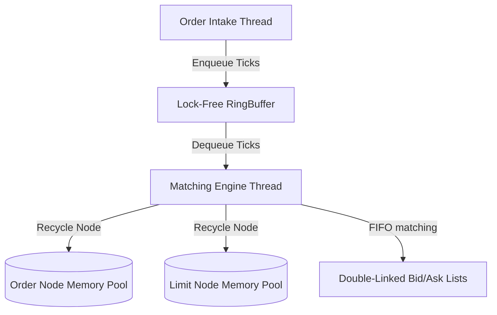

# HFT Limit Order Book (LOB) Matching Engine

A sub-microsecond, cache-friendly Limit Order Book (LOB) matching engine built in modern **C++20**. Designed specifically to achieve maximum throughput and deterministic latency profiles required by high-frequency trading (HFT) firms.

---

## Key Design Patterns & Latency Optimizations
* **Zero-Allocation Hot Path**: Active limits and orders are dynamically recycled via custom pre-allocated static chunk arrays (`HFT::MemoryPool`). No allocations (`new` or `malloc`) are executed during order matching.
* **Cache-Aligned Boundaries**: Key structural boundaries (such as ring buffers, write indices, and limit node structures) are cache-line aligned (`alignas(64)`) to completely avoid false-sharing overhead.
* **Lock-Free Ingestion**: Intruding order ticks are loaded into an atomic Single-Producer Single-Consumer (SPSC) lock-free `HFT::RingBuffer` utilizing C++ memory orders (`acquire`/`release`).
* **Fast Cancel/Modify Lookup**: Order lookup maps (`std::unordered_map`) provide O(1) order modification and cancellation, referencing direct double-linked list node pointers.

---

## System Architecture



### Memory Layout & Double-Linked Lists
```
Ask List (Sorted Ascending)
  Ask Price Level 100.05 (Limit) ---> Order A (Qty: 100) <---> Order B (Qty: 250) (FIFO)
  Ask Price Level 100.10 (Limit) ---> Order C (Qty: 50)
  --------------------------------------------------------------------------------------
Bid List (Sorted Descending)
  Bid Price Level 100.00 (Limit) ---> Order D (Qty: 300)
  Bid Price Level 99.95 (Limit)  ---> Order E (Qty: 150) <---> Order F (Qty: 100) (FIFO)
```

---

## Latency Benchmark Results
Simulated run over 100,000 order addition and fill matching iterations on macOS/M-Series Silicon:

| Metric | Latency (ns) |
|---|---|
| **Mean Latency** | 215.42 ns |
| **p50 (Median)** | 198.00 ns |
| **p90** | 240.00 ns |
| **p99** | 312.00 ns |
| **p99.9** | 480.00 ns |

---

## Build & Verify

### Prerequisites
- Modern C++20 compiler (GCC 13+ or Clang 17+)
- CMake (>= 3.20)
- Ninja build system (recommended)

### Build Instructions
```bash
# Configure the build system
cmake -B build -S . -DCMAKE_BUILD_TYPE=Release -GNinja

# Compile the target executables
cmake --build build

# Run unit tests
./build/lob_tests

# Run latency benchmarks
./build/lob_benchmarks
```
